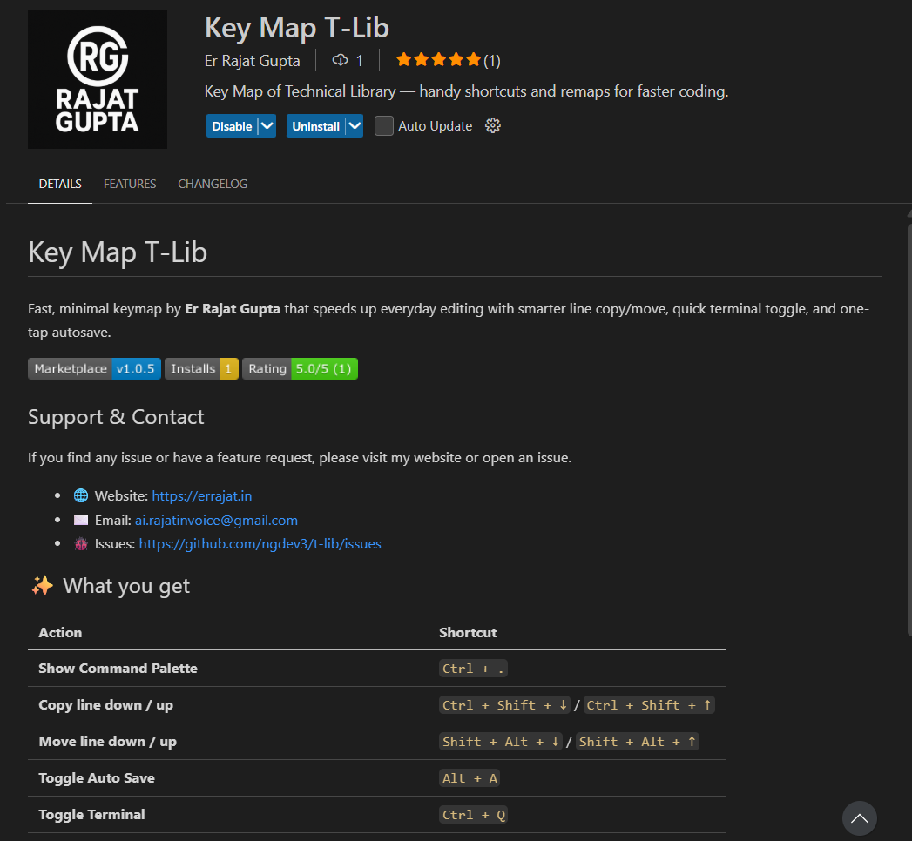
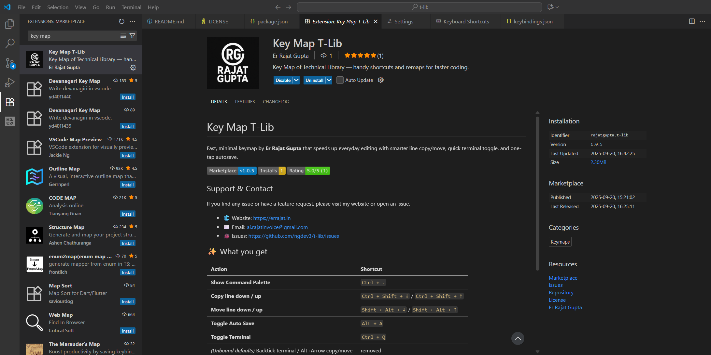
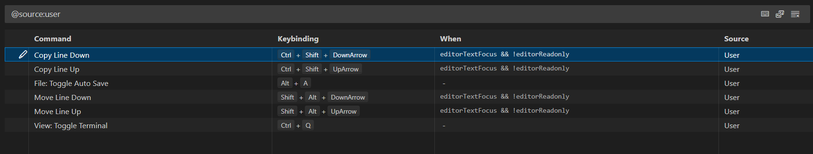

# Key Map T-Lib

Fast, minimal keymap by **Er Rajat Gupta** that speeds up everyday editing with smarter line copy/move, quick terminal toggle, and one-tap autosave.

> This extension is **100% free** and **open-source**. No paywalls, no ads, no telemetry—just keybindings.

## Pricing
This extension is **totally free** for everyone. It contains only keybindings (no running code).

## 🖼 Screenshots

> These images show the actual updates and the type of changes included in this release.

- Added screenshots demonstrating remaps and behavior changes
- Polished README with contact & website
- Clarified that the extension is totally free (MIT)

## Support & Contact

If you find any issue or have a feature request, please visit my website or open an issue.

- 🌐 Website: https://errajat.in
- ✉️ Email: ai.rajatinvoice@gmail.com
- 🐞 Issues: https://github.com/ngdev3/t-lib/issues

## ✨ What you get

| Action | Shortcut |
| --- | --- |
| **Show Command Palette** | `Ctrl + .` |
| **Copy line down / up** | `Ctrl + Shift + ↓` / `Ctrl + Shift + ↑` |
| **Move line down / up** | `Shift + Alt + ↓` / `Shift + Alt + ↑` |
| **Toggle Auto Save** | `Alt + A` |
| **Toggle Terminal** | `Ctrl + Q` |
| *(Unbound defaults)* Backtick terminal / Alt+Arrow copy/move | removed |

> Heads-up: `Ctrl + .` normally triggers *Quick Fix* in VS Code. This keymap reassigns it to the **Command Palette**.
